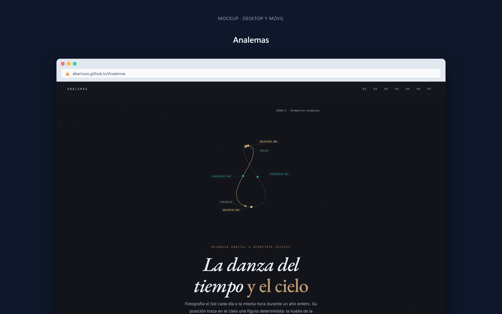
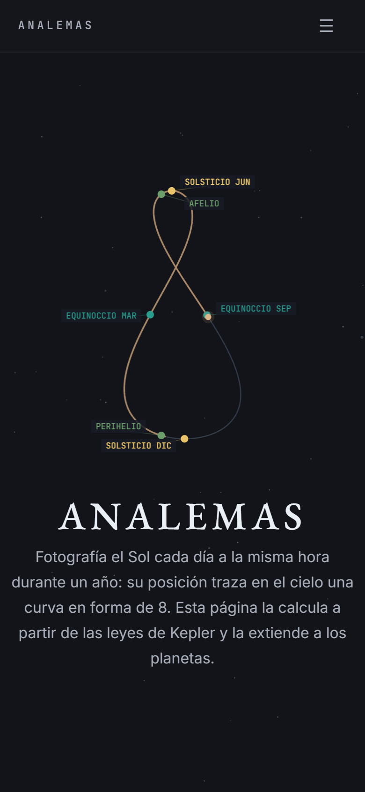
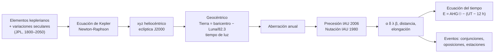
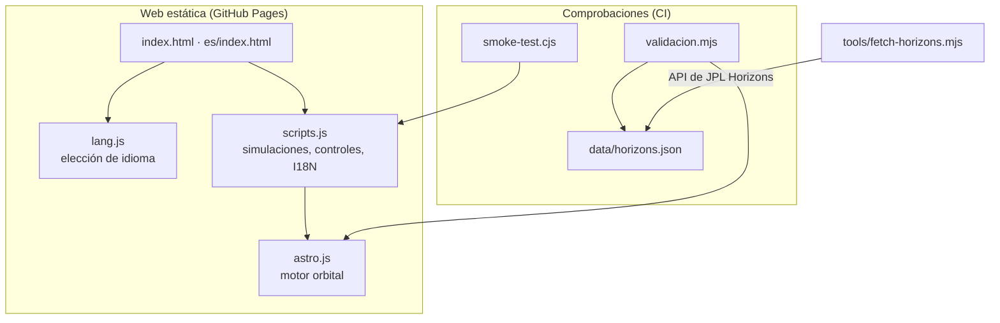

# Analemas

[](https://github.com/abarriuso/Analemas/actions/workflows/ci.yml)
[](https://github.com/abarriuso/Analemas/actions/workflows/deploy.yml)
[](LICENSE)

[English](README.md) · **Español**

La ecuación del tiempo, el analema solar, los bucles retrógrados de los planetas y el pentagrama de Venus, calculados con un pequeño motor de efemérides escrito desde cero y contrastado con NASA/JPL Horizons. JavaScript sin dependencias ni compilación, dibujado con Canvas 2D.

**[→ Ver en vivo (español)](https://abarriuso.github.io/Analemas/es/)** · [Versión en inglés](https://abarriuso.github.io/Analemas/)

| Escritorio | Móvil |
|:---:|:---:|
|  |  |

## Qué se puede hacer

- **Analema solar de cualquier año entre 1800 y 2050**, día a día: ecuación del tiempo, mediodía del reloj de sol en hora solar media local, los términos de excentricidad y de oblicuidad por separado, declinación, y el equinoccio, el perihelio y el afelio de ese año.
- **Bucles retrógrados**: cada oposición (o conjunción inferior) real de cada planeta entre 1800 y 2050, vista desde arriba, con las líneas de visión desde la Tierra, y en el cielo, con los puntos estacionarios, el arco retrógrado y su duración. Coordenadas eclípticas o ecuatoriales.
- **El pentagrama de Venus**, en cualquier ciclo de 8 años, visto desde la Tierra (elongación) o desde arriba (la línea Tierra–Venus, que dibuja una rosa de cinco pétalos), con los ciclos siguientes superpuestos para ver la deriva.
- Línea de tiempo con control deslizante, teclado (← →), lectura de valores al pasar el ratón, inglés y español, y respeto de `prefers-reduced-motion`.

## El motor

`astro.js` convierte una fecha en posiciones geocéntricas aparentes como lo hace una efeméride, pero con elementos keplerianos en lugar de integración numérica:



- Elementos y tasas: Standish y Williams, *Approximate positions of the planets* (JPL, tabla 1). Ecuación de Kepler hasta |ΔE| < 10⁻¹².
- La Tierra es el baricentro Tierra–Luna corregido con la posición de la Luna (términos principales de Meeus, 1998, cap. 47). El tiempo de luz de los planetas se itera.
- Marco: eclíptica J2000 → ecuador J2000 → precesión IAU 2006 (Capitaine et al., 2003) → nutación IAU 1980 de 106 términos (tabla y argumentos fundamentales de `nut80` de ERFA) → ecuador y equinoccio verdaderos de la fecha.
- Ecuación del tiempo a partir de su definición, con el ángulo de rotación terrestre y el polinomio del tiempo sidéreo IAU 2006. La serie clásica `E_exc + E_obl` (Meeus, 1998, cap. 28) se conserva para mostrar los dos efectos por separado.
- Eventos por bisección: conjunciones y oposiciones en longitud eclíptica, puntos estacionarios donde dλ/dt = 0.

Fuera del modelo: las perturbaciones mutuas entre planetas (la principal fuente de error), la refracción, la paralaje y ΔT (< 0.2 s en la ecuación del tiempo).

## Validación

`validacion.mjs` se ejecuta en cada push. Sus datos de referencia (`data/horizons.json`) salen de la API de NASA/JPL Horizons (DE441) y se regeneran con `node tools/fetch-horizons.mjs`.

| Comprobación | Casos | Resultado |
|---|---|---|
| Nutación: valor de prueba de ERFA y ejemplo 22.a de Meeus | 2 | 10⁻¹⁹ rad; 0.001″ |
| α, δ aparentes del Sol y 7 planetas, 1800–2050 | 2 936 | Sol 9″ RMS, Mercurio 10″, Venus 13″, Marte 34″, Júpiter 211″, Saturno 360″ |
| Ecuación del tiempo, 1805–2050 | 440 | ≤ 1.1 s |
| Serie `E_exc + E_obl` frente a la E exacta | 440 | ≤ 0.95 s |
| Conjunciones inferiores de Venus / Mercurio, 1995–2035 | 25 / 126 | ≤ 14 min / ≤ 4 min |
| Oposiciones y estaciones de Marte, Júpiter y Saturno | 282 | ≤ 4.2 h |
| Tránsitos de Venus, 1995–2035 | 2 | encontrados los de 2004-06-08 y 2012-06-06, ninguno falso |

Las diferencias que quedan son las de los propios elementos keplerianos: el JPL da para esa tabla errores heliocéntricos nominales de 15″ a 600″.

```text
pnpm install
pnpm test        # validacion.mjs + smoke-test.cjs + ESLint, html-validate y Stylelint
```

Los pull requests pasan además Lighthouse CI, que falla por debajo de los umbrales de `.lighthouserc.json`.

## Estructura



| Archivo | Contenido |
|---|---|
| `astro.js` | Motor orbital (unas 350 líneas, sin dependencias) |
| `scripts.js` | Simulaciones, controles de la línea de tiempo e interfaz; textos en `I18N` |
| `index.html`, `es/index.html`, `styles.css` | Contenido en inglés y en español, y estilos |
| `lang.js` | Elige el idioma (ver [Idiomas](#idiomas)) |
| `validacion.mjs`, `data/horizons.json`, `tools/fetch-horizons.mjs` | Validación frente a JPL Horizons y la herramienta que descarga sus datos de referencia |
| `smoke-test.cjs` | Ejecuta la página sobre un DOM mínimo en los dos idiomas y acciona todos los controles |

## Ejecución

Abre `index.html` (inglés) o `es/index.html` (español) en el navegador: funciona sin servidor.

## Idiomas

La web está en inglés en la raíz y en español en `es/`, con un enlace EN/ES en el menú. `lang.js` lleva la primera vez a `es/` a los navegadores en español; cuando el visitante elige idioma con ese enlace, la elección se recuerda. Los textos generados en JavaScript salen del bloque `I18N` de `scripts.js` según `<html lang>`.

## Trabajos relacionados

El analema es un tema clásico y existen otras herramientas de código abierto sobre él. Este proyecto se desarrolló de forma independiente (su historial empieza el 26 de mayo de 2026); la lista siguiente se hizo después, en septiembre de 2026, para situarlo entre ellas.

| Proyecto | Qué hace |
|---|---|
| [bhagany/snowth](https://github.com/bhagany/snowth) (Clojure, 2016) | Analemas a partir de parámetros orbitales, también de otros planetas |
| [VinnieM-3/Equation-of-Time-and-Analemma](https://github.com/VinnieM-3/Equation-of-Time-and-Analemma) (Python, 2019) | Controles de oblicuidad, excentricidad y perihelio |
| [benlansdell/analemma](https://github.com/benlansdell/analemma) (three.js, 2023) | Sistema solar en 3D para explorar la ecuación del tiempo |
| [russellgoyder/analemma](https://github.com/russellgoyder/analemma) (Python, 2023) | Paquete de analemas y relojes de sol en la Tierra o en cualquier planeta |

Lo que distingue a este: una cadena de cálculo de efemérides (precesión y nutación IAU, tiempo de luz, aberración, la Luna) contrastada con JPL Horizons en cada push, fechas reales de 1800 a 2050, y los bucles retrógrados y el pentagrama de Venus, que ninguno de los anteriores trata.

## Créditos

- **Idea y primer prototipo:** [Sandra Fernández Domínguez](https://www.linkedin.com/in/sandra-fern%C3%A1ndez-dom%C3%ADnguez-31836a323/). Planteó el proyecto y construyó el primer prototipo de la web con un agente de IA.
- **Desarrollo:** [Adrián Barriuso Pizarro](https://github.com/abarriuso). Llevó ese prototipo hasta la web actual: el motor orbital y su validación, las simulaciones, los tests y el despliegue.

Bibliografía completa: [`docs/referencias-bibliograficas.md`](docs/referencias-bibliograficas.md). Licencia MIT.
