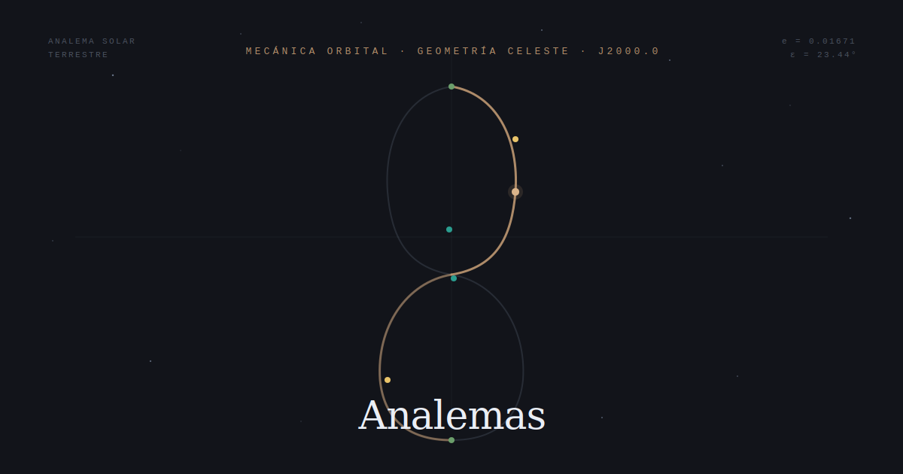

# Analemas

Simulación interactiva del analema solar, analemas geocéntricos planetarios y el pentagrama de Venus. Escrita en JavaScript puro (IIFE estricto) con Canvas 2D, sin dependencias externas ni proceso de compilación.



---

## Contenido

| Sección | Descripción |
|---|---|
| Hero | Analema animado con eventos orbitales (perihelio, solsticios, equinoccios) |
| Fundamentos | Excentricidad orbital y oblicuidad axial como causas del analema |
| Formalismo | Ecuación del tiempo, series de Fourier, solución de Kepler |
| Solar | Analema terrestre interactivo — 365 días, estadísticas en tiempo real |
| Planetas | Analemas geocéntricos de Mercurio a Neptuno, retrogradaciones en rojo |
| Venus | Pentagrama de Venus — resonancia 8:13:5, gráfico polar de 8 años |
| Tabla | Parámetros comparativos J2000.0 del sistema solar |
| Referencias | 19 fuentes bibliográficas en formato APA 7.ª ed. |

---

## Motor orbital

La ecuación de Kepler se resuelve por Newton-Raphson con umbral |ΔE| < 10⁻¹². La ecuación del tiempo se calcula en series de potencias de e (excentricidad) y tan(ε/2) (oblicuidad), siguiendo Meeus (1998, cap. 27). El error respecto al *Astronomical Almanac* es inferior a 30 segundos.

Los analemas planetarios simulan la posición geocéntrica de cada planeta durante 2000 pasos de un año sinódico. La retrogradación se detecta por el signo del incremento de longitud eclíptica entre fotogramas consecutivos.

El pentagrama de Venus es un gráfico polar donde el radio es la elongación geocéntrica y el ángulo es la longitud eclíptica geocéntrica, integrado sobre 8 años terrestres (5 períodos sinódicos, resonancia 8:13:5).

---

## Parámetros J2000.0

| Planeta | e | ε | T sidéreo | S sinódico |
|---|---|---|---|---|
| **Tierra** | 0.016708634 | 23.4393° | 365.25 d | — |
| Mercurio | 0.2056 | 0.034° | 87.97 d | 115.9 d |
| Venus | 0.0067 | 177.4° | 224.701 d | 583.9 d |
| Marte | 0.0934 | 25.19° | 686.97 d | 779.9 d |
| Júpiter | 0.0489 | 3.13° | 4 332.6 d | 398.9 d |
| Saturno | 0.0565 | 26.73° | 10 759 d | 378.1 d |
| Urano | 0.0472 | 97.77° | 30 589 d | 369.7 d |
| Neptuno | 0.0086 | 28.32° | 60 182 d | 367.5 d |

Fuentes: Williams (2024) · Meeus (1998) · USNO/HMNAO (2024)

---

## Ejecución

```
git clone https://github.com/abarriuso/Analemas.git
cd Analemas
# Abre index.html en el navegador — no requiere servidor
```

---

## Simplificaciones declaradas

- Inclinaciones orbitales = 0 (órbitas coplanares con la eclíptica)
- Perturbaciones N-cuerpos y correcciones relativistas ignoradas
- Parámetros e, ε, ω fijos en J2000.0

---

## Autores

**Sandra Fernández Domínguez** — [LinkedIn](https://www.linkedin.com/in/sandra-fern%C3%A1ndez-dom%C3%ADnguez-31836a323/)  
**Adrián Barriuso Pizarro** — [GitHub @abarriuso](https://github.com/abarriuso)

---

## Referencias seleccionadas

1. Meeus, J. (1998). *Astronomical Algorithms* (2.ª ed.). Willmann-Bell.
2. Williams, D. R. (2024). *Planetary Fact Sheets*. NASA GSFC.
3. Duffett-Smith, P. (1990). *Astronomy with your personal computer*. Cambridge University Press.
4. Müller, M. (1995). Equation of time. *Acta Physica Polonica A*, 88(S-49).
5. di Cicco, D. (1979). The analemma. *Sky & Telescope*, 57(6), 536–540.

[Lista completa de 19 referencias en la web →](https://abarriuso.github.io/Analemas/)

---

*MIT License · Vanilla JS · Sin dependencias · 2026*
