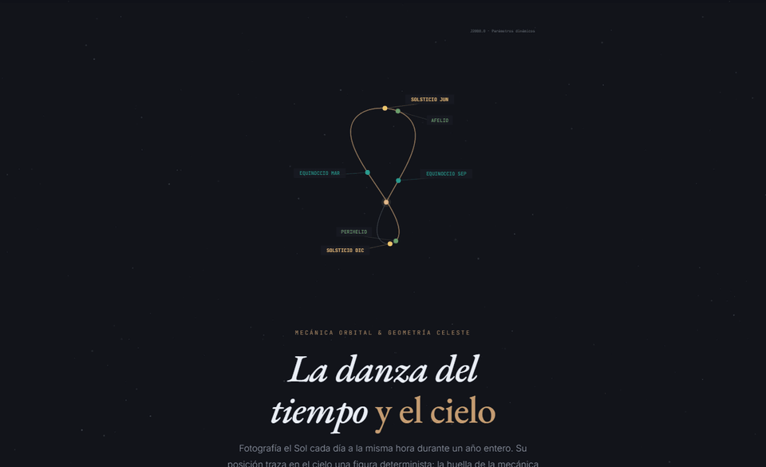

# Analemas

Simulación interactiva del analema solar, analemas geocéntricos planetarios y el pentagrama de Venus. Escrita en JavaScript puro (IIFE estricto) con Canvas 2D, sin dependencias externas ni proceso de compilación.

[](https://abarriuso.github.io/Analemas/)

**[→ Ver demo en vivo](https://abarriuso.github.io/Analemas/)**

---

## Contenido

| Sección | Descripción |
|---|---|
| Hero | Analema animado con eventos orbitales (perihelio, solsticios, equinoccios) |
| Fundamentos | Excentricidad orbital y oblicuidad axial como causas del analema |
| Formalismo | Ecuación del tiempo, series de Fourier, solución de Kepler |
| Solar | Analema terrestre interactivo — 365 días, estadísticas en tiempo real |
| Planetas | Analemas geocéntricos de Mercurio a Neptuno, retrogradaciones en rojo |
| Venus | Pentagrama de Venus — casi-resonancia 8:13:5, modelo 3D con inclinación, deriva de ~2.3°/ciclo |
| Tabla | Parámetros comparativos J2000.0 del sistema solar |
| Referencias | 22 fuentes bibliográficas en formato APA 7.ª ed., verificadas contra DOI/ADS/catálogos |

---

## Motor orbital

Para cada cuerpo se integran las leyes de Kepler a partir de seis elementos orbitales J2000.0 (Standish 1992, JPL Mean Elements): semieje mayor *a*, excentricidad *e*, período sidéreo *T*, longitud heliocéntrica del perihelio ϖ y anomalía media M₀ en J2000.0. La ecuación de Kepler `E − e·sin(E) = M` se resuelve por Newton-Raphson con umbral |ΔE| < 10⁻¹² (≤ 10 iteraciones para e < 0.3). Las posiciones se devuelven en coordenadas eclípticas heliocéntricas (eje +x → equinoccio vernal) y se proyectan al ecuador celeste con ε = 23.4393°.

La ecuación del tiempo se desarrolla en series: `E_exc = −(2e − e³/4)·sin M − (5/4)e²·sin 2M − (13/12)e³·sin 3M` (= −ecuación del centro a O(e³)) más la serie de oblicuidad hasta el sexto armónico en tan(ε/2) (Meeus 1998, cap. 28; Hughes, Yallop & Hohenkerk 1989). El error frente al *Astronomical Almanac* 2024 es **≤ 0.06 min ≈ 4 s** en amplitud y < 0.5 d en fecha para los cuatro extremos canónicos. Validación reproducible: `node validacion.mjs`.

Los analemas planetarios geocéntricos se calculan en 400–600 pasos sobre el período sinódico. La retrogradación se detecta por el signo del incremento de longitud eclíptica entre fotogramas consecutivos (dos frames seguidos con δlon < 0).

El pentagrama de Venus usa un **modelo 3D con inclinación orbital** (i = 3.39471°, Ω = 76.68069°) y une las **5 conjunciones inferiores** del ciclo de 8 años **en orden cronológico**: cada conjunción ocurre ~215.5° más adelante en longitud eclíptica, de modo que la estrella {5/2} emerge sola, sin reordenación artificial. El modelo reproduce las conjunciones inferiores reales de 2001–2007 con error ≤ 1 día (incluido el tránsito del 8 jun 2004, con elongación mínima de 0.18°). La casi-resonancia 8:13:5 **no es exacta**: la sexta conjunción cae ~2.3° por detrás de la primera y el pentagrama precesa una vuelta completa en ~1 300 años; la web lo muestra con un marcador rojo al completar el ciclo.

---

## Parámetros J2000.0 (Standish 1992 · JPL Mean Elements)

| Planeta | a (UA) | e | ε | T sidéreo | S sinódico | ϖ | M₀ |
|---|---|---|---|---|---|---|---|
| **Tierra** | 1.00000 | 0.016709 | 23.4393° | 365.25 d | — | 102.94° | 357.53° |
| Mercurio | 0.38710 | 0.20563 | 0.034° | 87.97 d | 115.9 d | 77.46° | 174.79° |
| Venus | 0.72333 | 0.00677 | 177.4° | 224.701 d | 583.9 d | 131.56° | 50.42° |
| Marte | 1.52366 | 0.09339 | 25.19° | 686.98 d | 779.9 d | 336.04° | 19.41° |
| Júpiter | 5.20336 | 0.04839 | 3.13° | 4 332.6 d | 398.9 d | 14.73° | 19.68° |
| Saturno | 9.53707 | 0.05415 | 26.73° | 10 759.2 d | 378.1 d | 92.60° | 317.35° |
| Urano | 19.19126 | 0.04717 | 97.77° | 30 685.4 d | 369.7 d | 170.95° | 142.28° |
| Neptuno | 30.06896 | 0.00859 | 28.32° | 60 189 d | 367.5 d | 44.96° | 259.92° |

ϖ = longitud heliocéntrica del perihelio. M₀ = anomalía media en J2000.0 (1.5 ene 2000).
Fuentes: Standish (1992) · Williams (2024) · USNO/HMNAO (2024)

---

## Ejecución

```
git clone https://github.com/abarriuso/Analemas.git
cd Analemas
# Abre index.html en el navegador — no requiere servidor
```

---

## Simplificaciones declaradas

- Inclinaciones orbitales = 0 en los analemas geocéntricos de la sección 04 (el pentagrama de Venus de la sección 05 sí incluye i y Ω)
- Perturbaciones N-cuerpos, evolución secular y correcciones relativistas ignoradas
- Elementos *a, e, T, ϖ, M₀, ε* fijos en J2000.0 (sin precesión ni nutación)
- Aberración estelar, refracción atmosférica y paralaje diurna no incluidas

Estas simplificaciones se documentan también en `observaciones-criticas.md`, `dictamen-final.md` e `informe-auditoria.md`. El alcance del proyecto es divulgativo-educativo; no es un generador de efemérides de precisión.

---

## Accesibilidad y rendimiento

- **`prefers-reduced-motion`** respetado en los cinco canvases: si está activo, se muestra la curva completa estática sin animación de punto.
- **Pausa fuera del viewport** vía `IntersectionObserver`: ningún canvas consume CPU cuando no es visible.
- **DPR (device-pixel-ratio)** aplicado a todos los canvases para nitidez en pantallas Retina.
- ARIA labels, `role="img"` en canvases, `aria-live="polite"` en estadísticas, focus visible, skip-link.
- Lazy-start animaciones, memoización por planeta, caché DOM (`getElementById` solo al inicio).

---

## Autores

**Sandra Fernández Domínguez** — [LinkedIn](https://www.linkedin.com/in/sandra-fern%C3%A1ndez-dom%C3%ADnguez-31836a323/)  
**Adrián Barriuso Pizarro** — [GitHub @abarriuso](https://github.com/abarriuso)

---

## Referencias seleccionadas

1. Meeus, J. (1998). *Astronomical Algorithms* (2.ª ed.). Willmann-Bell.
2. Standish, E. M., Newhall, X. X., Williams, J. G., & Yeomans, D. K. (1992). Orbital ephemerides of the Sun, Moon, and planets. En P. K. Seidelmann (Ed.), *Explanatory supplement to the astronomical almanac* (cap. 5). University Science Books. [Elementos medios en línea](https://ssd.jpl.nasa.gov/planets/approx_pos.html)
3. Williams, D. R. (2024). *Planetary Fact Sheets*. NASA GSFC.
4. U.S. Naval Observatory & H.M. Nautical Almanac Office. (2024). *The Astronomical Almanac for the year 2024*.
5. Hughes, D. W., Yallop, B. D., & Hohenkerk, C. Y. (1989). The equation of time. *MNRAS*, 238(4), 1529–1535. [doi:10.1093/mnras/238.4.1529](https://doi.org/10.1093/mnras/238.4.1529)
6. Duffett-Smith, P. (1990). *Astronomy with your personal computer*. Cambridge University Press.
7. Müller, M. (1995). Equation of time. *Acta Physica Polonica A*, 88(S-49).
8. di Cicco, D. (1979). Exposing the analemma. *Sky & Telescope*, 57(6), 536–540.
9. Bricker, V. R., & Bricker, H. M. (2011). *Astronomy in the Maya codices*. American Philosophical Society.

[Lista completa de 22 referencias en la web →](https://abarriuso.github.io/Analemas/)

---

*MIT License · Vanilla JS · Sin dependencias · 2026*
