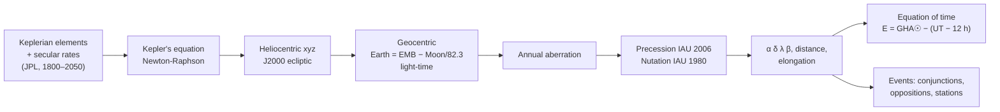
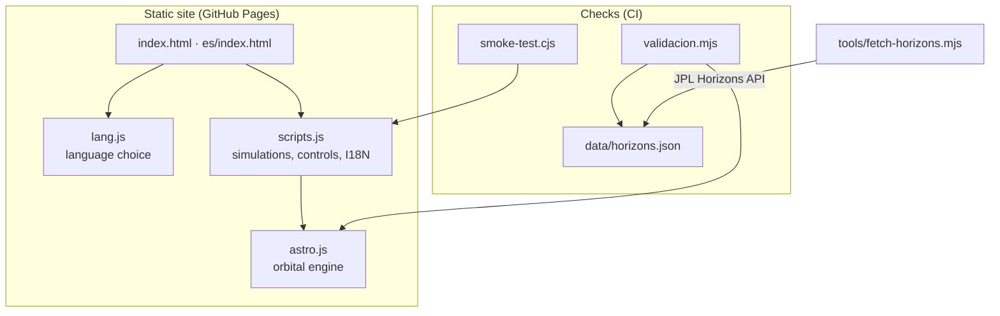

# Analemmas

[](https://github.com/abarriuso/Analemas/actions/workflows/ci.yml)
[](https://github.com/abarriuso/Analemas/actions/workflows/deploy.yml)
[](LICENSE)

**English** · [Español](README.es.md)

The equation of time, the solar analemma, the retrograde loops of the planets and the pentagram of Venus, computed by a small ephemeris engine written from scratch and checked against NASA/JPL Horizons. Dependency-free JavaScript with no build step, drawn with Canvas 2D.

**[→ Live demo](https://abarriuso.github.io/Analemas/)** · [Spanish version](https://abarriuso.github.io/Analemas/es/)

| Desktop | Mobile |
|:---:|:---:|
|  |  |

## What you can do with it

- **Solar analemma of any year from 1800 to 2050**, day by day: equation of time, sundial noon in local mean time, the eccentricity and obliquity terms on their own, declination, and that year's equinox, perihelion and aphelion.
- **Retrograde loops**: every real opposition (or inferior conjunction) of each planet between 1800 and 2050, shown from above, with the Earth's lines of sight, and on the sky, with the stationary points, the retrograde arc and its duration. Ecliptic or equatorial coordinates.
- **The pentagram of Venus**, any 8-year cycle, seen from Earth (elongation) or from above (the Earth–Venus line, which draws a five-petalled rose), with later cycles overlaid to show the drift.
- Timeline slider, keyboard control (← →), hover readouts, English and Spanish, and `prefers-reduced-motion` support.

## The engine

`astro.js` turns a date into apparent geocentric positions the way an ephemeris does, but with Keplerian elements instead of numerical integration:


```mermaid
flowchart LR
  A["Keplerian elements<br/>+ secular rates<br/>(JPL, 1800–2050)"] --> B["Kepler's equation<br/>Newton-Raphson"]
  B --> C["Heliocentric xyz<br/>J2000 ecliptic"]
  C --> D["Geocentric<br/>Earth = EMB − Moon/82.3<br/>light-time"]
  D --> E["Annual aberration"]
  E --> F["Precession IAU 2006<br/>Nutation IAU 1980"]
  F --> G["α δ λ β, distance,<br/>elongation"]
  G --> H["Equation of time<br/>E = GHA☉ − (UT − 12 h)"]
  G --> I["Events: conjunctions,<br/>oppositions, stations"]
```

- Elements and rates: Standish & Williams, *Approximate positions of the planets* (JPL, table 1). Kepler's equation to |ΔE| < 10⁻¹².
- The Earth is the Earth–Moon barycentre corrected by the Moon's position (main terms of Meeus, 1998, chap. 47). Light-time is iterated for the planets.
- Frame: J2000 ecliptic → J2000 equator → IAU 2006 precession (Capitaine et al., 2003) → IAU 1980 nutation, 106 terms (the ERFA `nut80` table and fundamental arguments) → true equator and equinox of date.
- Equation of time from its definition, with the Earth rotation angle and the IAU 2006 sidereal-time polynomial. The classic series `E_exc + E_obl` (Meeus, 1998, chap. 28) is kept to show the two effects apart.
- Events by bisection: conjunctions and oppositions in ecliptic longitude, stationary points where dλ/dt = 0.

Left out: mutual perturbations between planets (the main source of error), refraction, parallax and ΔT (< 0.2 s in the equation of time).

## Validation

`validacion.mjs` runs on every push. Its reference data (`data/horizons.json`) comes from the NASA/JPL Horizons API (DE441) and is rebuilt with `node tools/fetch-horizons.mjs`.

| Check | Cases | Result |
|---|---|---|
| Nutation, ERFA test value and Meeus example 22.a | 2 | 10⁻¹⁹ rad; 0.001″ |
| Apparent α, δ of the Sun and 7 planets, 1800–2050 | 2 936 | Sun 9″ RMS, Mercury 10″, Venus 13″, Mars 34″, Jupiter 211″, Saturn 360″ |
| Equation of time, 1805–2050 | 440 | ≤ 1.1 s |
| Series `E_exc + E_obl` against the exact E | 440 | ≤ 0.95 s |
| Inferior conjunctions of Venus / Mercury, 1995–2035 | 25 / 126 | ≤ 14 min / ≤ 4 min |
| Oppositions and stations of Mars, Jupiter and Saturn | 282 | ≤ 4.2 h |
| Transits of Venus, 1995–2035 | 2 | 2004-06-08 and 2012-06-06 found, no false ones |

The remaining differences are those of the Keplerian elements themselves: JPL quotes nominal heliocentric errors of 15″–600″ for this table.

```text
pnpm install
pnpm test        # validacion.mjs + smoke-test.cjs + ESLint, html-validate and Stylelint
```

Pull requests also run Lighthouse CI, which fails below the thresholds in `.lighthouserc.json`.

## Layout


```mermaid
flowchart TB
  subgraph site["Static site (GitHub Pages)"]
    html["index.html · es/index.html"] --> lang["lang.js<br/>language choice"]
    html --> scripts["scripts.js<br/>simulations, controls, I18N"]
    scripts --> astro["astro.js<br/>orbital engine"]
  end
  subgraph checks["Checks (CI)"]
    val["validacion.mjs"] --> astro
    val --> data["data/horizons.json"]
    smoke["smoke-test.cjs"] --> scripts
  end
  tool["tools/fetch-horizons.mjs"] -->|JPL Horizons API| data
```

| File | Contents |
|---|---|
| `astro.js` | Orbital engine (about 350 lines, no dependencies) |
| `scripts.js` | Simulations, timeline controls and interface; interface strings in `I18N` |
| `index.html`, `es/index.html`, `styles.css` | Content in English and in Spanish, and styles |
| `lang.js` | Picks the language (see [Languages](#languages)) |
| `validacion.mjs`, `data/horizons.json`, `tools/fetch-horizons.mjs` | Validation against JPL Horizons and the tool that downloads its reference data |
| `smoke-test.cjs` | Runs the page on a minimal DOM in both languages and works every control |

## Running it

Open `index.html` (English) or `es/index.html` (Spanish) in a browser: no server needed.

## Languages

The site is in English at the root and in Spanish under `es/`, with an EN/ES link in the menu. `lang.js` sends Spanish-speaking browsers from the root to `es/` the first time; once a visitor picks a language with that link, the choice is remembered. Text drawn from JavaScript comes from the `I18N` block in `scripts.js`, chosen by `<html lang>`.

## Related work

The analemma is a classic subject and there are other open-source tools about it. This project was developed independently (its history starts on 26 May 2026); the list below was put together afterwards, in September 2026, to place it among them.

| Project | What it does |
|---|---|
| [bhagany/snowth](https://github.com/bhagany/snowth) (Clojure, 2016) | Analemmas from orbital parameters, including other planets |
| [VinnieM-3/Equation-of-Time-and-Analemma](https://github.com/VinnieM-3/Equation-of-Time-and-Analemma) (Python, 2019) | Sliders for obliquity, eccentricity and perihelion |
| [benlansdell/analemma](https://github.com/benlansdell/analemma) (three.js, 2023) | 3D solar system to explore the equation of time |
| [russellgoyder/analemma](https://github.com/russellgoyder/analemma) (Python, 2023) | Package for analemmas and sundials on Earth or any planet |

What sets this one apart: an ephemeris pipeline (IAU precession and nutation, light-time, aberration, the Moon) checked against JPL Horizons on every push, real dates from 1800 to 2050, and the retrograde loops and the pentagram of Venus, which none of the projects above covers.

## Credits

- **Idea and first prototype:** [Sandra Fernández Domínguez](https://www.linkedin.com/in/sandra-fern%C3%A1ndez-dom%C3%ADnguez-31836a323/). She came up with the project and built the first prototype of the site with an AI agent.
- **Development:** [Adrián Barriuso Pizarro](https://github.com/abarriuso). He took it from that prototype to the current site: the orbital engine and its validation, the simulations, the tests and the deployment.

Full bibliography: [`docs/references.md`](docs/references.md). MIT licence.
